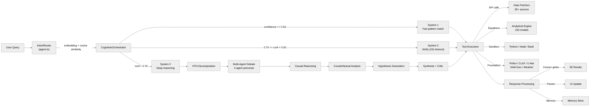
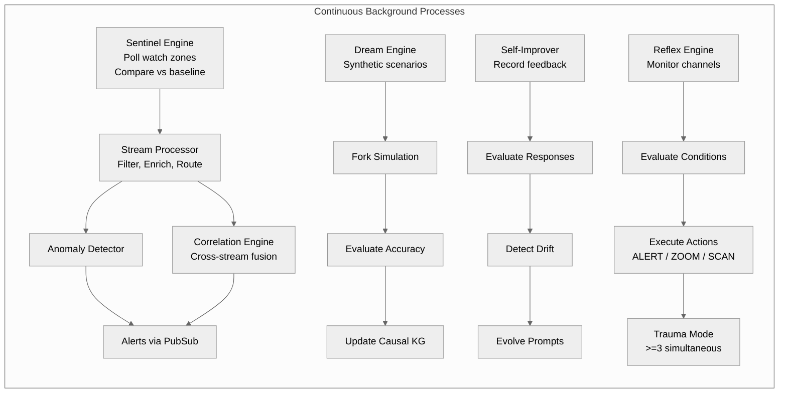

# Terreanoetis

A real-time geospatial data visualization and AI-powered Earth intelligence platform. Combines a Cesium-based 3D globe with a comprehensive backend serving live environmental data, satellite imagery, analytical models, simulations, and AI-driven insights.

## Architecture


**Request Flow:**



**Background Processes:**



### Frontend (`src/`)

- **Framework:** React 19 with TypeScript, built with Vite 7
- **3D Rendering:** CesiumJS 1.140 with custom shaders and rendering layers
- **Styling:** Tailwind CSS 3.4 with class-variance-authority component patterns
- **Routing:** React Router 7 with multi-page support
- **State Management:** React context (AuthContext) + custom hooks + WebSocket store

**Key frontend modules:**

| Module | Directory | Purpose |
|--------|-----------|---------|
| Globe & Rendering | `src/rendering/` | 36 rendering modules: weather, aviation, maritime, satellite, earthquakes, military symbology, terrain, IDW interpolation, scenario engine, ghost protocol, fork renderer, entropy halo, and more |
| Viewer | `src/viewer/` | Cesium viewer configuration and camera controller |
| Components | `src/components/` | Panel-based UI: AnalyticsWorkbench, IntelligencePanel, PrithviPanel, SatelliteSearch, SatelliteTracker, AviationTracker, MilitarySymbology, Scenario components (Gallery, Editor, Viewer, CinematicDirector, SpatialSketching), ToolDialog, ForkPanel, DigitalTwinPanel, IssLivePanel, cockpit panels, and more |
| Pages | `src/pages/` | Main App, GlobePage, CanvasPage, ScenariosPage, ToursPage, AdminDashboard |
| Data | `src/data/` | Analytical models definitions (150 tools with metadata) |
| Lib | `src/lib/` | API client, chat store, batch scheduler, terrain sampler, unified timer, utilities |
| Hooks | `src/hooks/` | WebSocket hook |
| Context | `src/context/` | Authentication context |

### Backend (`server/`)

- **Runtime:** Node.js with Express.js 4, TypeScript via tsx
- **Database:** SQLite (better-sqlite3) with Redis (ioredis) for caching
- **Real-time:** WebSocket server (ws) for live data streaming
- **Authentication:** JWT-based auth with role-based access control
- **Observability:** Pino logging, Prometheus metrics, OpenTelemetry tracing
- **Security:** Helmet CSP, CORS, rate limiting, SSRF guard, input validation

**Server modules (62 entries):**

| Module | Purpose |
|--------|---------|
| `server/index.ts` | Main Express application entry point (~1500+ lines) with route registration, middleware, agent system, and all API integrations |
| `server/agent.ts` | Cognitive agent system with command parsing, intent routing, tool registry, and LLM orchestration |
| `server/analytical-models/` | 150 scientific equation engines with workflow runners, context engine, and REST API |
| `server/cognition/` | Cognitive architecture: System 1 (fast), System 2 (slow), tree-of-thoughts, MCTS engine, reasoning tree, execution orchestrator |
| `server/sentinel/` | Ambient intelligence engine: stream processor, anomaly detector, correlation engine, force posture analysis, road traffic detector, proactive insights |
| `server/foundation-models/` | Earth observation AI models: Prithvi (v1 & v2), IBM CLAY, U-Net segmenter, SAM-Geo, agriculture monitor, weather forecaster, AlphaEarth, SpaceX API, bayesian fire detector, satellite search/seed, MVT tile server |
| `server/multimodal/` | Multimodal perception: satellite analyzer, seismic processor, radar interpreter, sentiment analyzer, multimodal fusion |
| `server/scenarios/` | Disaster scenario generation, batch generation, enhanced BBOX-based generation, geographic validation, simulation, export (GeoJSON/CZML/NetCDF), database |
| `server/simulation/` | Physics simulation bridge for real-world data integration |
| `server/world-model/` | World modeling: causal graph, ensemble predictor, physics neural network, prediction validator, scenario simulator |
| `server/causal/` | Causal reasoning: knowledge graph, discovery engine, entropy mixer, Python microservice |
| `server/kg-v2/` | Knowledge graph v2: entity generation, edge generation, graph completion, counterfactual graph, evolving graph |
| `server/memory/` | Memory systems: planetary memory system, Redis adapter |
| `server/memory-v2/` | Memory v2: working memory, episodic memory, semantic memory, procedural memory, predictive memory, sensory buffer |
| `server/tools-v2/` | Dynamic tool system: generator, composer, discovery, self-healing executor, repair |
| `server/self-evolution/` | Self-improvement: code writer, test runner, git integration, intent discovery, bandit router, performance monitor |
| `server/meta-cognition/` | Meta-cognition: architecture proposals, prompt evolution, intent discovery, performance analysis, feedback learning, self-report |
| `server/explainability/` | AI explainability: reasoning visualizer, evidence chain, uncertainty quantification, bias auditor, human override |
| `server/ai-router/` | AI model router (OmniNet) for multi-model LLM orchestration |
| `server/reflex/` | Reflex engine for autonomous reactive behaviors |
| `server/fork/` | Fork management: create divergent AI reasoning branches, compare and merge |
| `server/maritime/` | AIS vessel tracking with real-time WebSocket streaming |
| `server/military/` | OSINT bridge for military intelligence data |
| `server/digitalTwin/` | Digital twin analysis, data fetching, orchestration |
| `server/dream/` | Dream engine for AI-generated exploratory simulations |
| `server/h3-engine/` | H3 hexagonal spatial indexing with spatial query engine, ClickHouse and TimescaleDB integrations |
| `server/grid/` | NetCDF reader for gridded scientific data |
| `server/db/` | SQLite database setup, schema, reasoning traces |
| `server/data/` | Data fetchers for climate, ocean, glacier, permafrost, soil moisture, satellite thermal, volcanoes, and more |
| `server/routes/` | Route handlers: foundation models, self-evolution, vault, pulse dashboard |
| `server/middleware/` | Auth (JWT), rate limiting, tenant isolation, audit logging, validation, error handler |
| `server/observability/` | Logging (Pino), metrics (Prometheus), error classes, OpenTelemetry |
| `server/utils/` | Utility modules (29 files): FIRMS, EONET, ISS, MGRS, NDBC, OpenAQ, shake maps, SPC, VAAC, space debris, SSRF guard, GeoJSON, web transport, and more |
| `server/queue/` | Simple task queue for background processing |
| `server/infrastructure/` | Redis infrastructure setup |
| `server/plugins/` | Plugin system with example plugin |
| `server/sandbox-v2/` | Sandbox simulation engines: FARSITE (wildfire), ADCIRC (tsunami), WRF (atmosphere), HYSPLIT (ash dispersion), FNO surrogate (fast neural weather prediction) |
| `server/embedding.ts` | Text embedding engine for semantic search |
| `server/orchestrator.ts` | Agent orchestrator for multi-agent coordination |
| `server/pubsub.ts` | Publish-subscribe event bus |
| `server/resilience.ts` | Circuit breaker and retry mechanisms |
| `server/websocket.ts` | WebSocket server for real-time bidirectional communication |
| `server/selfImprover.ts` | Self-improvement engine with feedback management and analytics |
| `server/selfImprover-v2.ts` | Improved self-improvement architecture |
| `server/pluginManager.ts` | Plugin manager for extensibility |
| `server/sandboxManager.ts` | Sandbox execution manager |
| `server/mcp.ts` | Model Context Protocol integration |
| `server/costOptimizer.ts` | Model routing, cost tracking, enhanced caching |

## API Endpoints

The server exposes hundreds of API endpoints across the following categories:

- **Authentication:** `/api/auth/login`, `/api/auth/dev-login`
- **Seismic:** `/api/earthquakes`, `/api/earthquakes/significant`, `/api/tectonic`, `/api/shakemap/*`
- **Weather:** `/api/weather/open-meteo`, `/api/weather/alerts`, `/api/weather/nhc`, `/api/weather/flood`, `/api/weather/marine`, `/api/weather/ensemble`, `/api/weather/seasonal`, `/api/weather/historical`, `/api/weather/air-quality`, `/api/weather/gfs`, `/api/weather/drought`, `/api/weather/climate-indices`, `/api/weather/ibtracs`, `/api/radar/rainviewer`, `/api/climate/power`, `/api/climate/anomalies`, `/api/climate/co2`, `/api/climate/sea-ice`
- **Hazards:** `/api/eonet`, `/api/firms`, `/api/gdacs/alerts`, `/api/vaac/*`, `/api/volcanoes`, `/api/lightning`
- **Aviation:** `/api/flights`, `/api/flights/all`, `/api/flights/military`, `/api/adsb-lol`, `/api/airlabs`, `/api/openflights`, `/api/airspaces`
- **Maritime:** `/api/ais`, `/api/ais/nearby`, `/api/submarine-cables`
- **Space:** `/api/satellites/tle`, `/api/space-debris`, `/api/space-weather/kp`, `/api/space-weather/donki`, `/api/nasa-dsn`, `/api/aurora`, `/api/iss`, `/api/spacex/launches`, `/api/spacex/starlink`
- **Earth Observation:** `/api/fm/prithvi/*`, `/api/fm/prithvi-v2/*`, `/api/fm/clay/*`, `/api/fm/unet/*`, `/api/fm/weather/*`, `/api/fm/agri/*`, `/api/fm/samgeo/*`, `/api/fm/alpha/*`, `/api/fm/search`, `/api/satellite/process`, `/api/tiles/*`, `/api/road-traffic/*`, `/api/bayfire/*`
- **Multimodal:** `/api/multimodal/satellite/*`, `/api/multimodal/seismic/*`, `/api/multimodal/radar/*`, `/api/multimodal/sentiment/*`, `/api/multimodal/fusion/*`
- **Simulation:** `/api/simulate/run`, `/api/simulate/templates`
- **Scenarios:** `/api/scenarios/generate`, `/api/scenarios/generate-from-bbox`, `/api/scenarios/search`, `/api/scenarios/export/*`
- **Analytical Models:** `/api/analytical-models`, `/api/analytical-models/search`, `/api/analytical-models/:id`, `/api/analytical-models/:id/execute`
- **Fork:** `/api/fork/*`
- **Pulse:** `/api/pulse/*`
- **Vault:** `/api/vault/*`
- **Self-Evolution:** `/api/self-evolve/*`
- **Health:** `/api/health`, `/api/ready`, `/api/live`, `/api/metrics`

## Analytical Models

The platform implements 150 scientific equation engines covering 26 Earth science domains:

| Domain | Tools | Examples |
|--------|-------|---------|
| Land Surface Temperature | 1-3 | Split-window LST, Brightness Temperature, Planck Radiation |
| Atmospheric Science | 4-10 | Pressure Profile, Geostrophic Wind, Evapotranspiration, Stability Indices |
| Hydrology | 11-20 | Runoff, Flood Frequency, Sediment Transport, Groundwater Flow |
| Oceanography | 21-30 | Wave Energy, Tidal Harmonic, Mixed Layer Depth, Coastal Inundation |
| Geophysics & Seismology | 31-40 | Moment Magnitude, Seismic Moment, Attenuation, Fault Slip Rate |
| Remote Sensing & Cryosphere | 41-50 | NDVI, NDSI, Albedo, SWE, Glacier Mass Balance |
| Spatial & Extreme Events | 51-60 | Topographic Wetness, Slope Stability, Fire Behavior Index |
| Soil & Land Surface | 61-70 | Soil Moisture, Erosivity, Hydraulic Conductivity, Carbon Flux |
| Air Quality & Pollution | 71-80 | AQI, Gaussian Plume, Deposition Velocity, Ventilation Coefficient |
| Climate & Energy | 81-90 | RQI, Cooling Degree Days, Solar Potential, Wind Power Density |
| Ecology & Carbon Cycle | 91-100 | NPP, GPP, Carbon Stock, Habitat Suitability, Biodiversity Index |
| Coastal & Estuarine | 101-110 | Sediment Flux, Salt Intrusion, Marsh Accretion, Tidal Prism |
| Infrastructure & Risk | 111-120 | Seismic Hazard, Liquefaction, Flood Depth, Building Damage |
| Agriculture & Food Security | 121-130 | Crop Yield, ET, Water Productivity, Frost Risk, Growing Degree Days |
| Geodesy & Geodynamics | 131-140 | InSAR Displacement, GNSS Velocity, Moho Depth, Plate Motion |
| Space & Advanced Physics | 141-150 | Ionospheric Delay, Doppler Shift, Hohmann Transfer, Lagrange Points, Mutual Information |

Each tool is defined with:
- `toolId`, `name`, `vizType` (heatmap, spectrum, scalar, profile, vector, gauge, timeseries, isopleth, rose, classification)
- Input parameters with `name`, `type`, `default`, `min`/`max`, `step`, `description`
- Structured workflow steps with `equation`, `calculation`, `intermediate variables`, `unit conversion`
- Quality control checks with `name`, `passed`, `message`, `severity`
- Academic references with `paperUrl` (DOI or Google Scholar)

## Panel System

The UI uses a dynamic z-index stacking manager. Panels can be toggled from the toolbar and bring themselves to front when activated.

**Available panels:**
- Analytics Workbench
- Intelligence Feed
- Satellite Tracker
- Satellite Search
- Satellite Imagery
- Aviation Tracker
- Prithvi Earth Observation
- Military Symbology
- Fork Manager (multiverse)
- Scenario Gallery, Editor, Viewer
- Cinematic Director
- Spatial Sketching
- Study Area
- Cognitive Dashboard
- Tool Workbench
- Memory Explorer
- Settings
- Digital Twin
- ISS Live
- API Vault
- Command Palette

## Infrastructure

### Docker Deployment

```yaml
services:
  terranoetis:     # Main application (Express + Vite)
  redis:           # Caching and pub/sub
  causal-service:  # Python causal inference microservice
```

### External Dependencies

- **Cesium Ion** – 3D globe terrain and imagery tiles
- **Redis** – Caching, session store, pub/sub messaging
- **SQLite** – Application database (auth, scenarios, memory traces)
- **Various APIs** – See `.env` for full list of 30+ integrated data providers

### CI/CD

GitHub Actions workflow (`.github/workflows/ci.yml`) for automated testing and build.

## Security

- JWT-based authentication with role-based access control
- Helmet CSP headers with restrictive content security policy
- Rate limiting (per-IP and per-user)
- SSRF guard for outbound URL validation
- Input validation with Zod schemas
- Audit logging for sensitive operations
- Tenant isolation for multi-user scenarios
- Automatic JWT secret strength validation at startup
- Protected routes with fine-grained public/private endpoint classification

## Getting Started

### Prerequisites

- Node.js 20+
- Redis server (or Docker)
- Cesium Ion access token (free tier at https://ion.cesium.com)

### Installation

```bash
cp .env .env.local    # Edit with your API keys
npm install
```

### Development

```bash
npm run dev           # Starts client (port 3000), server (port 3001), and Redis
```

### Build

```bash
npm run build         # TypeScript compilation + Vite production build
```

### Testing

```bash
npm test              # Vitest test runner
npx playwright test   # E2E tests (Playwright)
```

### Production

```bash
docker compose up -d  # Builds and starts all services
```

## Scripts

| Script | Purpose |
|--------|---------|
| `scripts/test_all_tools.ts` | End-to-end validation of all 150 analytical models |
| `scripts/runtime_validate.ts` | Runtime validation of tool outputs |
| `scripts/validate_all_tools.ts` | Comprehensive tool validation suite |
| `scripts/compute_ndvi.py` | Python NDVI computation helper |
| `scripts/compute_ndwi.py` | Python NDWI computation helper |

## WASM Modules

- `wasm/idw/` – Inverse Distance Weighting interpolation WebAssembly module

## Environment Variables

The `.env` file contains configuration for 30+ integrated services across categories:

- **Server:** PROXY_PORT, JWT_SECRET, CLIENT_ORIGIN
- **NASA Earthdata:** GNSS satellite orbit data
- **Satellite & Imagery:** Cesium Ion, Sentinel Hub, Copernicus, NASA FIRMS, Planet Labs, Maxar
- **Aviation:** FlightAware, AirLabs
- **Maritime:** AISStream, MarineTraffic
- **AI/LLM:** Google Gemini, Anthropic Claude, Groq, OpenRouter, Ollama
- **Weather & Disaster:** USGS, NASA EONET, GDACS, NWS, NOAA, OpenAQ, WAQI, Windy
- **Economic & Financial:** FRED, EIA, Alpha Vantage, ENTSO-E, UN Comtrade
- **Search & Scraping:** Brave Search, Exa, Firecrawl
- **Other:** Telegram, Resend, ACLED, GoldAPI, Cloudflare Radar, AbuseIPDB, AlienVault OTX
- **Foundation Models:** ECMWF CDS, E2B Sandbox

Services gracefully disable features when corresponding API keys are absent.

## Author

**[Sreyassanker](https://sreyassanker.vercel.app)** — [GitHub](https://github.com/sreyassanker) · [LinkedIn](https://linkedin.com/in/sreyassanker) · [Portfolio](https://sreyassanker.vercel.app)

## License

MIT — see [LICENSE](LICENSE).
