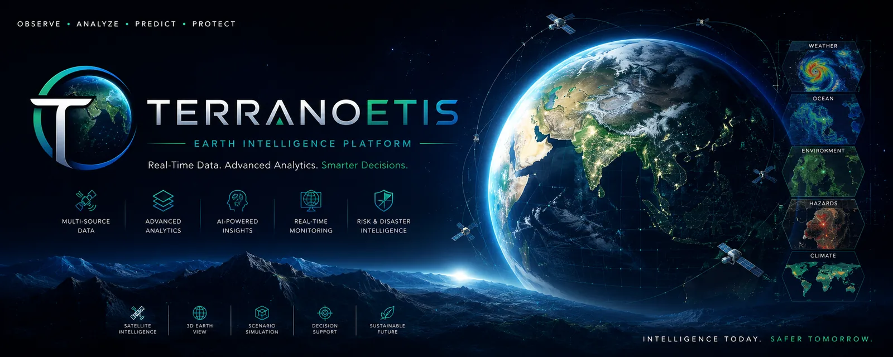

<p align="center">
  
</p>

A real-time geospatial intelligence platform. Combines a photorealistic Cesium 3D globe with a comprehensive backend serving live environmental data, satellite imagery, **150 real scientific equation engines**, physics simulations, realtime voice, and AI-driven cognition. Unlike a passive globe viewer, Terranoetis **computes** — it runs literature-grounded equations over live data, reasons about what it sees, and paints real results back onto the Earth.

<div align="center">

[](https://sreyassanker.vercel.app)
[](https://github.com/sreyassanker)
[](https://linkedin.com/in/sreyassanker)
[](https://buymeacoffee.com/sreyassanker)
[](https://youtube.com/playlist?list=PLFp9mjre3Lco&si=yDAxddidcQZ4w_km)

</div>

---

## Highlights

- **150 analytical models grounded in primary literature** across 26 domains — every equation cites its source paper, book, or standard (82 with resolvable DOIs; pre-DOI classics explicitly flagged) ([details](docs/MODELS.md))
- **Photorealistic CesiumJS 3D globe** with 41 rendering modules, satellite imagery, and sensor styles
- **7 GPU physics simulations** — earthquake, tsunami, volcano, landslide, flood, hurricane, wildfire
- **AI cognition** — System 1 / System 2 reasoning, multi-agent debate, causal + counterfactual analysis
- **30+ live data feeds** — seismic, weather, aviation, maritime, satellite, traffic, space
- **Realtime voice** — OpenAI Realtime → Gemini Live (server-side brokering)
- **Explainable AI** — evidence chains, uncertainty quantification, human-override workflow
- **Global model selector** — pick any LLM provider (or local GGUF) from the AI chat panel
- **One-click model install** — download the local LFM 2.5 2.6B Q4_K_M GGUF model directly from the admin panel with live progress, speed, ETA, and resume-on-interrupt
- **Smart study-area flow** — auto-detects real OSM boundaries, or lets you draw/adjust one
- **Worldwide timezone support** — set your location + timezone; all timestamps follow it

---

## Gallery

<table>
  <tr>
    <td width="50%"><a href="gifs/Multi%20Hazard%20Risk%20Map.gif"></a></td>
    <td width="50%"><a href="gifs/Landslide%20simulation.gif"></a></td>
  </tr>
  <tr>
    <td align="center"><b>Multi-Hazard Risk Map</b><br/>fused live risk surfaces on the 3D globe</td>
    <td align="center"><b>Landslide Simulation</b><br/>one of 7 physics engines, run over real terrain</td>
  </tr>
  <tr>
    <td width="50%"><a href="gifs/Aviation%20Tracker.gif"></a></td>
    <td width="50%"><a href="gifs/Satellite%20Tracker.gif"></a></td>
  </tr>
  <tr>
    <td align="center"><b>Aviation Tracker</b><br/>live ADS-B flights on the globe</td>
    <td align="center"><b>Satellite Tracker</b><br/>real-time TLE orbit propagation</td>
  </tr>
</table>

---

## Quick Start

```bash
git clone https://github.com/sreyassanker/Terranoetis.git
cd Terranoetis
cp .env.example .env    # Fill in API keys as needed
npm install
npm run dev             # Vite (3000) + Express API (3001); Redis optional
```

> Redis is optional — the server falls back to SQLite automatically if Redis is unavailable. See [Deployment](docs/DEPLOYMENT.md) for the full Docker + production setup.

---

## Documentation

| Document | Covers |
|---|---|
| [Architecture](docs/ARCHITECTURE.md) | System topology, request flow, background services, module inventory |
| [API Reference](docs/API.md) | 360+ REST endpoints + WebSocket channel |
| [Frontend](docs/FRONTEND.md) | React components, rendering engine, Kaggle GPU overlays, hooks |
| [Backend](docs/BACKEND.md) | Server modules, cognition, memory, security, observability |
| [Analytical Models](docs/MODELS.md) | The 150 equation engines, 7 parts, 26 domains |
| [Deployment](docs/DEPLOYMENT.md) | Docker, environment variables, Kaggle token setup, CI/CD, security |

---

## Repository Structure

```
terranoetis/
├── src/                          # React 19 + CesiumJS frontend
│   ├── main.tsx                  # Router: /, /v2/globe, /v2/canvas, /v2/scenarios, /v2/tours
│   ├── App.tsx                   # Globe shell (~11k lines, 11 lazy-loaded panels)
│   ├── components/               # UI components (chat/, cockpit/, scenarios/, kaggle/, ...)
│   ├── rendering/                # 41 Cesium rendering modules (ais, flights, satellites, ...)
│   ├── hooks/                    # useChat, useWebSocket, useRealtimeVoice, ...
│   ├── lib/                      # API client, chat store, formatTime, DuckDB, PDF
│   ├── data/                     # Analytical models catalog, land cover classes
│   ├── store/                    # Zustand: chat store, user location/timezone prefs
│   └── __tests__/                # Frontend unit tests
│
├── server/                       # Express 4 + TypeScript API
│   ├── index.ts                  # App entry: routes, middleware, background services (~13.8k lines)
│   ├── agent.ts                  # Intent router + cognition pipeline
│   ├── analytical-models/        # 150 equations, 7 parts, 26 domains
│   ├── cognition/                # System 1 / System 2, MCTS, tree-of-thoughts
│   ├── sentinel/                 # Continuous monitoring, anomaly detection
│   ├── memory/ + memoryV2/       # Working/episodic/semantic/procedural memory
│   ├── ai-router/                # Omninet 9-provider LLM router (incl. local GGUF)
│   ├── digitalTwin/              # Regional analysis pipeline
│   ├── sandboxV2/                # Simulation engines (FARSITE, ADCIRC, WRF, HYSPLIT)
│   ├── causal/ + kgV2/           # Causal reasoning + knowledge graph
│   ├── scenarios/                # Disaster scenario generation
│   ├── data/                     # 30+ live data fetchers
│   ├── db/                       # SQLite schema (47 tables), migrations
│   ├── middleware/               # JWT auth, rate limiter, validation, audit
│   ├── observability/            # Pino, OpenTelemetry, Sentry
│   ├── selfImprover.ts           # Feedback-driven prompt evolution
│   └── __tests__/                # 1,600+ unit + integration tests
│
├── kaggle-kernels/               # 7 Python physics simulations (earthquake, tsunami, volcano, ...)
├── server/plugins/               # Plugin system: install from URL / GitHub / raw code / zip
├── docs/                         # Topic-specific documentation
│   ├── ARCHITECTURE.md
│   ├── API.md
│   ├── FRONTEND.md
│   ├── BACKEND.md
│   ├── MODELS.md
│   ├── DEPLOYMENT.md
│   ├── index.html                # Standalone project landing page
│   └── Research papers/          # Source PDFs for the equation catalog
│
├── e2e/                          # Playwright browser tests (7 specs, 12 tests)
├── gifs/                         # README gallery captures
├── scripts/                      # Dev utilities + legacy test scripts
├── data/                         # Runtime databases + ML models
├── models/                       # Local GGUF model (downloadable from admin panel) → gitignored
├── public/                       # Static assets (Cesium, DuckDB-WASM, fonts, models)
│
├── docker-compose.yml            # 3 services (terranoetis + redis + causal-service)
├── Dockerfile                    # Multi-stage build (node:20-alpine)
├── .github/workflows/ci.yml      # 10 CI jobs (typecheck, lint, tests, coverage, build, docker, audit, browser, summary)
├── package.json                  # 97 dependencies, 14 scripts
├── tsconfig.json                 # Project references: app + node + server + scripts
├── vite.config.ts                # Vite 7 config with Cesium plugin
├── playwright.config.ts          # Playwright: WebGL args, reuse server
└── vitest.config.ts              # Vitest: include server + frontend tests
```

| Command | Purpose |
|---|---|
| `npm run dev` | Concurrent: server + client (+ Redis if available) |
| `npm run dev:client` | Vite dev server on :3000 |
| `npm run dev:server` | Express API on :3001 |
| `npm run build` | `tsc -b && vite build` |
| `npm test` | Vitest — unit + integration tests |
| `npm run test:unit` | Unit tests only |
| `npm run test:integration` | Integration + e2e tests |
| `npm run test:coverage` | Coverage report |

---

## Testing

```bash
npm test              # Vitest — unit + integration tests
npx playwright test   # Playwright — Chromium with software WebGL (SwiftShader); runs headless in CI
```

---

## License

Terranoetis is licensed under the **Business Source License 1.1 (BUSL-1.1)**.

- **Free** to use, run locally, self-host for yourself, modify, learn from, and **contribute**.
- **Commercial use** — offering Terranoetis (or a modified version) to third parties as a hosted / embedded / SaaS service, or embedding it in a product you sell — requires a **separate commercial license**. Contact: **sreyassanker001@gmail.com**.
- Each version automatically converts to the **MIT License** **4 years** after it is published.

Third-party components (CesiumJS, ONNX models, satellite data sources, etc.) remain under their own original licenses.

Copyright (c) 2026 Sreyas S S.
