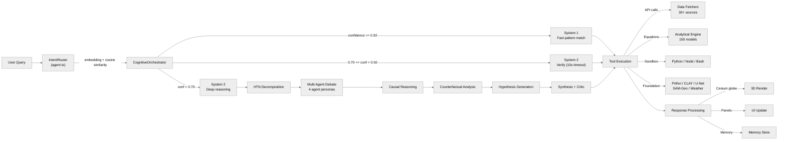
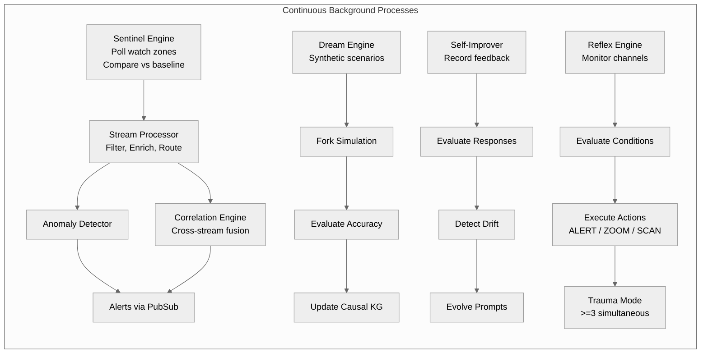

<p align="center">
  
</p>

# Terranoetis

A real-time geospatial data visualization and AI-powered Earth intelligence platform. Combines a Cesium-based 3D globe with a comprehensive backend serving live environmental data, satellite imagery, analytical models, simulations, and AI-driven insights.

<div align="center">

[](https://sreyassanker.vercel.app)
[](https://github.com/sreyassanker)
[](https://linkedin.com/in/sreyassanker)
[](https://buymeacoffee.com/sreyassanker)

</div>

## Architecture


**Request Flow:**



**Background Processes:**



### Frontend (`src/`)

- **Framework:** React 18 with TypeScript, built with Vite 5
- **3D Rendering:** CesiumJS 1.140, deck.gl, Mapbox GL JS
- **Styling:** Tailwind CSS 3 with class-variance-authority, dark mode by default
- **Routing:** React Router
- **State Management:** React context (AuthContext) + custom hooks + WebSocket store

**Routing (from `App.tsx`):**

| Route | View | Description |
|---|---|---|
| `/fullworld` | Globe | Main Cesium globe viewport |
| `/cockpit` | Dashboard | Mosaic layout: CognitiveDashboard, MemoryExplorer, SettingsPanel, ToolWorkbench |
| `/scenario` | Scenarios | Scenario gallery and editor |
| `/login` | Login | Authentication page |

**Core components:**

| Component | Lines | Description |
|---|---|---|
| **Topbar** | 270 | Dark glass toolbar: clock, branding, status indicators (connection/memory/entities), theme toggle, auth, hatch animation |
| **Sidebar** | 455 | Collapsible left panel with 9 layer groups (Natural Hazards, Infrastructure, Environment, Flights, AIS, Satellites, Military, Tectonic, Custom) |
| **SearchBox** | 225 | Geocoding search with globe fly-to, suggestion dropdown |
| **ModularModal** | 472 | Generic modal: title, body, footer, accent color, z-index |
| **Tile3DLayer** | 273 | Cesium 3D Tiles: tileset creation, style JSON, bounding sphere padding, SSE |
| **CommandPalette** | — | Cmd+K palette: search layers/locations/actions, toggle/fly-to/open intel |
| **PerformanceMonitor** | 250 | Real-time FPS/entities/primitives/memory/JS heap, toggle Ctrl+Shift+P |
| **FlightTravelView** | 1250 | Flight deck HUD: compass, alt/heading tapes, horizon, pitch ladder, 8-dir look, mach |
| **IssTravelView** | 370 | ISS orbital HUD: nadir/horizon compass, pitch tape, Earth-viewing mode |
| **IssLivePanel** | — | ISS camera iframe + position stats (lat/lon/alt/speed) |
| **IntelligencePanel** | 1700 | 8-tab intel: Market, Energy, Geopolitical, Correlation, Sentiment, Heatmap, Analysis, Force Posture |
| **ToolDialog** | 2500 | Analysis tool execution: study area, params, grid, execution, results, export |
| **DigitalTwinPanel** | — | Recharts charts (Area/Bar/Pie/Line), stat cards, recommendations |
| **CameraControls** | — | Zoom slider + log-scale height + fly-to-target |
| **ForkPanel** | — | Parallel realities: pause/resume/terminate, divergence score |
| **ErrorBoundary** | — | React class-based, optional label + reset |
| **LoginModal** | — | Auth token check, manual login, listens for `auth:required` event |
| **CesiumContext.tsx** | — | React context providing Cesium.Viewer instance |
| **useCesium** | — | Hook returning CesiumContext value with optional lazy init |

**Component subdirectories:**

`src/components/chat/` — `AdvancedChatViews.tsx` (850L): PlanCard, SubAgentActivity, InlineTable/Chart/Slider, ToolApproval, ModelTierSelector, TraceExpander

`src/components/cockpit/`:
- `CognitiveDashboard.tsx` (860L) — AnimatedBrain SVG, sparklines, system metrics
- `MemoryExplorer.tsx` (530L) — SVG Knowledge Graph (force-directed)
- `SettingsPanel.tsx` (600L) — 4 tabs: Cognitive (S1/S2 bias), Alerts, Providers, Privacy
- `ToolWorkbench.tsx` (1570L) — Physics causal chain builder, IDW risk surface, Noisy-OR CBN, physics surrogates

`src/components/scenarios/` (12 files):
- `types.ts` — Point3D, ShapeData (11 types), Scenario, ScenarioSummary, SCENARIO_TYPE_LABELS/COLORS
- `CinematicDirector.tsx` (643L) — Camera path animation for disaster fly-throughs
- `EarthquakeVisualizer.tsx` (206L) — MMI polygons, P/S/Rayleigh/Love wavefront rings
- `hazardRenderers.ts` (188L) — Renders 11 shape types on Cesium (polygon, cylinder, corridor, ellipse, ring, flood_surface, wavefront, intensity/damage/liquefaction zones)
- `ScenarioEditor.tsx` (568L) — Parameter forms for 7 disaster types
- `ScenarioGallery.tsx` (147L) — Sortable/filterable grid, search
- `AddScenarioModal.tsx`, `ScenarioGraph.tsx`, `ScenarioPanel.tsx`, `ScenarioTimeline.tsx`, `ScenarioWizard.tsx`, `ScenarioThumbnail.tsx`

Scenario types and colors:

| Key | Label | Color |
|---|---|---|
| `earthquake_swarm` | Earthquake | `#ef4444` |
| `hurricane_landfall` | Hurricane | `#f59e0b` |
| `wildfire_spread` | Wildfire | `#ff6b35` |
| `volcanic_eruption` | Volcanic | `#d946ef` |
| `flood_inundation` | Flood | `#3b82f6` |
| `tsunami_wave` | Tsunami | `#06b6d4` |
| `landslide` | Landslide | `#78350f` |
| `data_layer` | Data Layer | `#10b981` |

`src/components/prithvi/`:
- `AviationTrackerPanel.tsx` (560L) — Live OpenSky flights, search/filter
- `PrithviPanel.tsx` (940L) — NASA Prithvi AI: land cover, embedding search, change detection
- `SatelliteSearchPanel.tsx` (680L) — Semantic imagery search (text/geo/class), seeder status
- `SatelliteTrackerPanel.tsx` (530L) — TLE catalog (CelesTrak/UCS/Starlink), track button

`src/components/explainability/` — `HumanOverrideBanner.tsx` (420L): pending override approval/rejection

`src/components/ui/` — 18 Radix-based primitives: Button, Checkbox, Dialog, DropdownMenu, Input, Label, ScrollArea, Select, Separator, Slider, Switch, Tabs, Textarea, Tooltip, ToggleGroup, Panel, ApiVault, SatelliteImageryPanel, StudyAreaPanel, ChartComponents

**Kaggle overlays (7 files)** — each fetches `.npy` raster data and renders Cesium `SingleTileImageryProvider` with custom colormaps:

| File | Layers | Lines |
|---|---|---|
| `KaggleEarthquakeOverlay.tsx` | PGA / PGV / MMI (red-yellow) | 204 |
| `KaggleFloodOverlay.tsx` | Water depth + terrain (3-mode) | 411 |
| `KaggleHurricaneOverlay.tsx` | Wind speed + surge + rainfall | 317 |
| `KaggleLandslideOverlay.tsx` | Debris depth + velocity + runout | 304 |
| `KaggleTsunamiOverlay.tsx` | Wave height + bathymetry | 203 |
| `KaggleVolcanoOverlay.tsx` | Ash deposit + lava thickness | 304 |
| `KaggleWildfireOverlay.tsx` | Fire intensity + fire state | 205 |

**Rendering engine (`src/rendering/`, 33 files):**

| File | Purpose |
|---|---|
| `ais.ts` | Maritime AIS vessel positions/tracks |
| `aviation.ts` | Flight tracking (real-time aircraft + paths) |
| `flights.ts` | Flight route arcs (departure/arrival) |
| `earthquakes.ts` | Earthquake markers (magnitude-scaled, depth-colored) |
| `satelliteDataSources.ts` | TLE orbit propagation & rendering |
| `satelliteImagery.ts` | GIBS/XYZ/WMS imagery layer management |
| `satnogs.ts` | SatNOGS ground station visualization |
| `osmBuildings.ts` | OSM 3D building extrusion |
| `surfaceRenderer.ts` | IDW interpolation surface rendering |
| `gisFusion.ts` | GIS data fusion for risk surfaces |
| `studyArea.ts` | GeoJSON upload/draw/export/fly-to |
| `scenarioEngine.ts` | What-if scenario definition/rollout/diff |
| `causalGraph.ts` | Noisy-OR causal Bayesian network |
| `blackboard.ts` | Blackboard pattern for probability writing |
| `physicsSurrogates.ts` | Physics surrogates: liquefaction, dispersion, wildfire, flood |
| `domainLayers.ts` | Domain-specific layer management |
| `advancedWaterShader.ts` | Custom water shader |
| `GhostEntity.ts` / `ghostProtocol.ts` | Ghost entity rendering + protocol |
| `entropyHalo.ts` | Entropy halo visualization |
| `forkRenderer.ts` | Parallel reality fork rendering |
| `layerRenderer.ts` | Generic layer rendering abstraction |
| `navigation.ts` | Navigation utilities |
| `oracleChains.ts` | Oracle chain visualization |
| `idwInterpolation.ts` | IDW interpolation algorithm |
| `tectonic.ts` | Tectonic plate data |
| `weather.ts` | Weather data |
| `trajectoryPredictor.ts` | Trajectory prediction |
| `toolResultParser.ts` | Tool result parsing |
| `ucsSatelliteDb.ts` | UCS satellite database |
| `shpjs.d.ts` | Shapefile type declarations |

**Hooks (14 total):**

| Hook | Storage | Purpose |
|---|---|---|
| `useSettings` | LocalStorage | User settings persistence |
| `useTheme` | LocalStorage | Dark/light theme toggle |
| `useAuth` | SessionStorage | Auth state + token |
| `useWebSocket` | — | Socket.IO connection manager |
| `useMapConfig` | React state | Map configuration from server |
| `useUserPreferences` | React state | User preferences CRUD |
| `useUserPreferencesPanel` | React state | Panel-specific settings |
| `useNotifications` | React state | Alert/notification system |
| `useSavedMap` | React state | Saved maps CRUD |
| `useLayerToggle` | React state | Layer visibility toggles |
| `useSession` | React state | Session management |
| `useLocalStorage` | LocalStorage | Generic typed storage |
| `useUser` | React state | User data fetching |
| `useApi` | — | Generic API fetcher |

### Backend (`server/`)

- **Runtime:** Node.js with Express.js 4, TypeScript via tsx
- **Database:** SQLite (better-sqlite3) with Redis (ioredis) for caching
- **Real-time:** WebSocket server (ws) for live data streaming
- **Authentication:** JWT-based auth with role-based access control
- **Observability:** Pino logging, Prometheus metrics, OpenTelemetry tracing
- **Security:** Helmet CSP, CORS, rate limiting, SSRF guard, input validation

**Server modules (62 entries):**

| Module | Purpose |
|--------|---------|
| `server/index.ts` | Main Express application entry point (~10200 lines) with route registration, middleware, agent system, AI pipeline, and all API integrations |
| `server/agent.ts` | Cognitive agent system with command parsing, intent routing, tool registry, and LLM orchestration |
| `server/analytical-models/` | 150 scientific equation engines with workflow runners, context engine, and REST API |
| `server/cognition/` | Cognitive architecture: System 1 (fast), System 2 (slow), tree-of-thoughts, MCTS engine, reasoning tree, execution orchestrator |
| `server/sentinel/` | Ambient intelligence engine: stream processor, anomaly detector, correlation engine, force posture analysis, road traffic detector, proactive insights |
| `server/foundation-models/` | Earth observation AI models: Prithvi (v1 & v2), IBM CLAY, U-Net segmenter, SAM-Geo, agriculture monitor, weather forecaster, AlphaEarth, SpaceX API, bayesian fire detector, satellite search/seed, MVT tile server |
| `server/multimodal/` | Multimodal perception: satellite analyzer, seismic processor, radar interpreter, sentiment analyzer, multimodal fusion |
| `server/scenarios/` | Disaster scenario generation, batch generation, enhanced BBOX-based generation, geographic validation, simulation, export (GeoJSON/CZML/NetCDF), database |
| `server/simulation/` | Physics simulation bridge for real-world data integration |
| `server/world-model/` | World modeling: causal graph, ensemble predictor, physics neural network, prediction validator, scenario simulator |
| `server/causal/` | Causal reasoning: knowledge graph, discovery engine, entropy mixer, Python microservice |
| `server/kg-v2/` | Knowledge graph v2: entity generation, edge generation, graph completion, counterfactual graph, evolving graph |
| `server/memory/` | Memory systems: planetary memory system, Redis adapter |
| `server/memory-v2/` | Memory v2: working memory, episodic memory, semantic memory, procedural memory, predictive memory, sensory buffer |
| `server/tools-v2/` | Dynamic tool system: generator, composer, discovery, self-healing executor, repair |
| `server/self-evolution/` | Self-improvement: code writer, test runner, git integration, intent discovery, bandit router, performance monitor |
| `server/meta-cognition/` | Meta-cognition: architecture proposals, prompt evolution, intent discovery, performance analysis, feedback learning, self-report |
| `server/explainability/` | AI explainability: reasoning visualizer, evidence chain, uncertainty quantification, bias auditor, human override |
| `server/ai-router/` | AI model router (OmniNet) for multi-model LLM orchestration |
| `server/reflex/` | Reflex engine for autonomous reactive behaviors |
| `server/fork/` | Fork management: create divergent AI reasoning branches, compare and merge |
| `server/maritime/` | AIS vessel tracking with real-time WebSocket streaming |
| `server/military/` | OSINT bridge for military intelligence data |
| `server/digitalTwin/` | Digital twin analysis, data fetching, orchestration |
| `server/dream/` | Dream engine for AI-generated exploratory simulations |
| `server/h3-engine/` | H3 hexagonal spatial indexing with spatial query engine, ClickHouse and TimescaleDB integrations |
| `server/grid/` | NetCDF reader for gridded scientific data |
| `server/db/` | SQLite database setup, schema, reasoning traces |
| `server/data/` | Data fetchers for climate, ocean, glacier, permafrost, soil moisture, satellite thermal, volcanoes, and more |
| `server/routes/` | Route handlers: foundation models, self-evolution, vault, pulse dashboard |
| `server/middleware/` | Auth (JWT), rate limiting, tenant isolation, audit logging, validation, error handler |
| `server/observability/` | Logging (Pino), metrics (Prometheus), error classes, OpenTelemetry |
| `server/utils/` | Utility modules (29 files): FIRMS, EONET, ISS, MGRS, NDBC, OpenAQ, shake maps, SPC, VAAC, space debris, SSRF guard, GeoJSON, web transport, and more |
| `server/queue/` | Simple task queue for background processing |
| `server/infrastructure/` | Redis infrastructure setup |
| `server/plugins/` | Plugin system with example plugin |
| `server/sandbox-v2/` | Sandbox simulation engines: FARSITE (wildfire), ADCIRC (tsunami), WRF (atmosphere), HYSPLIT (ash dispersion), FNO surrogate (fast neural weather prediction) |
| `server/embedding.ts` | Text embedding engine for semantic search |
| `server/orchestrator.ts` | Agent orchestrator for multi-agent coordination |
| `server/pubsub.ts` | Publish-subscribe event bus |
| `server/resilience.ts` | Circuit breaker and retry mechanisms |
| `server/websocket.ts` | WebSocket server for real-time bidirectional communication |
| `server/selfImprover.ts` | Self-improvement engine with feedback management and analytics |
| `server/selfImprover-v2.ts` | Improved self-improvement architecture |
| `server/pluginManager.ts` | Plugin manager for extensibility |
| `server/sandboxManager.ts` | Sandbox execution manager |
| `server/mcp.ts` | Model Context Protocol integration |
| `server/costOptimizer.ts` | Model routing, cost tracking, enhanced caching |

## API Endpoints

The server exposes hundreds of API endpoints across the following categories:

- **Authentication:** `/api/auth/login`, `/api/auth/dev-login`
- **Seismic:** `/api/earthquakes`, `/api/earthquakes/significant`, `/api/tectonic`, `/api/shakemap/*`
- **Weather:** `/api/weather/open-meteo`, `/api/weather/alerts`, `/api/weather/nhc`, `/api/weather/flood`, `/api/weather/marine`, `/api/weather/ensemble`, `/api/weather/seasonal`, `/api/weather/historical`, `/api/weather/air-quality`, `/api/weather/gfs`, `/api/weather/drought`, `/api/weather/climate-indices`, `/api/weather/ibtracs`, `/api/radar/rainviewer`, `/api/climate/power`, `/api/climate/anomalies`, `/api/climate/co2`, `/api/climate/sea-ice`
- **Hazards:** `/api/eonet`, `/api/firms`, `/api/gdacs/alerts`, `/api/vaac/*`, `/api/volcanoes`, `/api/lightning`
- **Aviation:** `/api/flights`, `/api/flights/all`, `/api/flights/military`, `/api/adsb-lol`, `/api/airlabs`, `/api/openflights`, `/api/airspaces`
- **Maritime:** `/api/ais`, `/api/ais/nearby`, `/api/submarine-cables`
- **Space:** `/api/satellites/tle`, `/api/space-debris`, `/api/space-weather/kp`, `/api/space-weather/donki`, `/api/nasa-dsn`, `/api/aurora`, `/api/iss`, `/api/spacex/launches`, `/api/spacex/starlink`
- **Earth Observation:** `/api/fm/prithvi/*`, `/api/fm/prithvi-v2/*`, `/api/fm/clay/*`, `/api/fm/unet/*`, `/api/fm/weather/*`, `/api/fm/agri/*`, `/api/fm/samgeo/*`, `/api/fm/alpha/*`, `/api/fm/search`, `/api/satellite/process`, `/api/tiles/*`, `/api/road-traffic/*`, `/api/bayfire/*`
- **Multimodal:** `/api/multimodal/satellite/*`, `/api/multimodal/seismic/*`, `/api/multimodal/radar/*`, `/api/multimodal/sentiment/*`, `/api/multimodal/fusion/*`
- **Simulation:** `/api/simulate/run`, `/api/simulate/templates`
- **Scenarios:** `/api/scenarios/generate`, `/api/scenarios/generate-from-bbox`, `/api/scenarios/search`, `/api/scenarios/export/*`
- **Analytical Models:** `/api/analytical-models`, `/api/analytical-models/search`, `/api/analytical-models/:id`, `/api/analytical-models/:id/execute`
- **Fork:** `/api/fork/*`
- **Pulse:** `/api/pulse/*`
- **Vault:** `/api/vault/*`
- **AI Agent:** `/api/agent/ask` (SSE streaming or JSON), `/api/agent/analyze-vision` (multimodal), `/api/agent/analyze-data` (CSV/GeoJSON), `/api/agent/local-ask` (Ollama fallback), `/api/agent/search-all` (unified RAG), `/api/agent/pipeline` (code execution + globe commands), `/api/agent/geocode` (LLM-based location lookup)
- **Self-Evolution:** `/api/self-evolve/*`
- **Health:** `/api/health`, `/api/ready`, `/api/live`, `/api/metrics`

## Analytical Models

The platform implements 150 scientific equation engines covering 26 Earth science domains:

| Domain | Tools | Examples |
|--------|-------|---------|
| Land Surface Temperature | 1-3 | Split-window LST, Brightness Temperature, Planck Radiation |
| Atmospheric Science | 4-10 | Pressure Profile, Geostrophic Wind, Evapotranspiration, Stability Indices |
| Hydrology | 11-20 | Runoff, Flood Frequency, Sediment Transport, Groundwater Flow |
| Oceanography | 21-30 | Wave Energy, Tidal Harmonic, Mixed Layer Depth, Coastal Inundation |
| Geophysics & Seismology | 31-40 | Moment Magnitude, Seismic Moment, Attenuation, Fault Slip Rate |
| Remote Sensing & Cryosphere | 41-50 | NDVI, NDSI, Albedo, SWE, Glacier Mass Balance |
| Spatial & Extreme Events | 51-60 | Topographic Wetness, Slope Stability, Fire Behavior Index |
| Soil & Land Surface | 61-70 | Soil Moisture, Erosivity, Hydraulic Conductivity, Carbon Flux |
| Air Quality & Pollution | 71-80 | AQI, Gaussian Plume, Deposition Velocity, Ventilation Coefficient |
| Climate & Energy | 81-90 | RQI, Cooling Degree Days, Solar Potential, Wind Power Density |
| Ecology & Carbon Cycle | 91-100 | NPP, GPP, Carbon Stock, Habitat Suitability, Biodiversity Index |
| Coastal & Estuarine | 101-110 | Sediment Flux, Salt Intrusion, Marsh Accretion, Tidal Prism |
| Infrastructure & Risk | 111-120 | Seismic Hazard, Liquefaction, Flood Depth, Building Damage |
| Agriculture & Food Security | 121-130 | Crop Yield, ET, Water Productivity, Frost Risk, Growing Degree Days |
| Geodesy & Geodynamics | 131-140 | InSAR Displacement, GNSS Velocity, Moho Depth, Plate Motion |
| Space & Advanced Physics | 141-150 | Ionospheric Delay, Doppler Shift, Hohmann Transfer, Lagrange Points, Mutual Information |

Each tool is defined with:
- `toolId`, `name`, `vizType` (heatmap, spectrum, scalar, profile, vector, gauge, timeseries, isopleth, rose, classification)
- Input parameters with `name`, `type`, `default`, `min`/`max`, `step`, `description`
- Structured workflow steps with `equation`, `calculation`, `intermediate variables`, `unit conversion`
- Quality control checks with `name`, `passed`, `message`, `severity`
- Academic references with `paperUrl` (DOI or Google Scholar)

## AI Intelligence Panel

The EARTH INTELLIGENCE AI panel (`Panel.tsx` wrapper with inline UI in `src/App.tsx`) provides a conversational AI assistant for the 3D globe. Nine major improvements have been implemented:

| # | Feature | Server | Client | Description |
|---|---------|--------|--------|-------------|
| 1 | **Multimodal in main chat** | `POST /api/agent/analyze-vision` | `streamPassMultimodal()` | Images attached to chat are sent as base64 to Gemini's streaming vision API. Falls back to text-only Omninet when Gemini is unavailable. |
| 2 | **Agentic globe control with undo** | `executeAgentCommands()` in SSE output | `agentActionHistoryRef`, `undoLastAgentAction()`, `clearAllAgentActions()` | Every AI action (flyTo, toggleLayer, addPin, addHeatmap, addPolygon, addGeoJSON, addChart, addPanel) is recorded. Undo reverts the last action; Clear removes all AI entities. Undo/Clear buttons in panel header. |
| 3 | **Persistent memory across sessions** | `buildWorkingMemoryContext(recentMessages)` | Sends last 8 messages as `recentMessages` | Client passes conversation history to server; server folds it into the working memory context instead of starting from empty on each query. |
| 4 | **Proactive context-aware suggestions** | Dynamic chip generation | Chips adapt to active layers + recent discoveries | Suggestion chips (earthquake, wildfire, flight, voyage, etc.) update based on which layers are active and recent discoveries from the ambient intelligence engine. |
| 5 | **Local model fallback** | `POST /api/agent/local-ask` → Ollama | `generateLocalResponse()` | When remote AI providers are unreachable, queries route to Ollama (llama3 on `localhost:11434`). Falls back to keyword matching if Ollama is also unavailable. |
| 6 | **Real-time streaming markdown** | SSE `event: output` with chunked tokens | Blinking `▊` cursor, auto-scroll on content change | Streaming assistant responses render incrementally with a cursor indicator. Scroll tracks content growth during streaming. |
| 7 | **Multi-provider transparency** | SSE includes `modelTier` in output event | Badge displayed on each assistant message | Users see which tier handled their query (e.g., "Free tier (local routing)", "Gemini Flash", "Claude") via a small badge on each AI response. |
| 8 | **Code pipeline → 3D globe** | `__GLOBE_COMMANDS__` protocol in sandbox stdout | `data.commands` handler in pipeline SSE | Pipeline sandbox code can emit `__GLOBE_COMMANDS__::[{...}]` markers in stdout. Server extracts the JSON and sends a `globe` SSE event. Client renders pins, polygons, heatmaps, charts on Cesium. |
| 9 | **RAG over live geospatial databases** | `POST /api/agent/search-all` + tools-v2 generator | Integrated into agent tool selection | Unified `search_all` endpoint routes natural language queries across all databases (earthquakes, weather, fires, flights, vessels, satellites, volcanoes). System prompt updated with explicit Query Planning section mapping intents → tools. |

## Panel System

The UI uses a dynamic z-index stacking manager. Panels can be toggled from the toolbar and bring themselves to front when activated.

**Available panels:**
- Analytics Workbench
- Intelligence Feed
- Satellite Tracker
- Satellite Search
- Satellite Imagery
- Aviation Tracker
- Prithvi Earth Observation
- Military Symbology
- Fork Manager (multiverse)
- Scenario Gallery, Editor, Viewer
- Cinematic Director
- Spatial Sketching
- Study Area
- Cognitive Dashboard
- Tool Workbench
- Memory Explorer
- Settings
- Digital Twin
- ISS Live
- API Vault
- Command Palette

## Infrastructure

### Docker Deployment

```yaml
services:
  terranoetis:     # Main application (Express + Vite)
  redis:           # Caching and pub/sub
  causal-service:  # Python causal inference microservice
```

**Dockerfile** (`Dockerfile`, multi-stage):
- **Base**: `node:20-alpine` with build deps (python3, make, g++)
- **Build**: `npm ci` → `npm run build` (tsc + vite)
- **Production**: `node:20-alpine` with `dumb-init`, `npm ci --omit=dev`
- **Healthcheck**: `curl -f http://localhost:3001/api/health`
- **Ports**: 3001 (server), 3000 (dev client)
- **Entrypoint**: `tsx server/index.ts`

### Database Schema (Prisma)

7 models in `server/DB-prisma/schema.prisma`:

| Model | Key Fields |
|---|---|
| `User` | id, username, password, role, createdAt |
| `Session` | id, userId, token, expiresAt |
| `MapConfig` | id, userId, center, zoom, layers |
| `Preferences` | id, userId, theme, settings |
| `Notification` | id, userId, type, message, read |
| `SavedMap` | id, userId, name, config |
| `LayerToggle` | id, userId, layerId, visible |

### External Dependencies

- **Cesium Ion** – 3D globe terrain and imagery tiles
- **Redis** – Caching, session store, pub/sub messaging
- **SQLite** – Application database (auth, scenarios, memory traces, reasoning)
- **Various APIs** – See `.env` for full list of 30+ integrated data providers

### CI/CD

GitHub Actions workflow (`.github/workflows/ci.yml`) for automated testing and build.

## Security

- JWT-based authentication with role-based access control
- Helmet CSP headers with restrictive content security policy
- Rate limiting (per-IP and per-user)
- SSRF guard for outbound URL validation
- Input validation with Zod schemas
- Audit logging for sensitive operations
- Tenant isolation for multi-user scenarios
- Automatic JWT secret strength validation at startup
- Protected routes with fine-grained public/private endpoint classification

## Getting Started

### Prerequisites

- Node.js 20+
- Redis server (or Docker)
- Cesium Ion access token (free tier at https://ion.cesium.com)

### Installation

```bash
cp .env .env.local    # Edit with your API keys
npm install
```

### Development

```bash
npm run dev           # Starts client (port 3000), server (port 3001), and Redis
```

### Build

```bash
npm run build         # TypeScript compilation + Vite production build
```

### Testing

```bash
npm test              # Vitest test runner
npx playwright test   # E2E tests (Playwright)
```

### Production

```bash
docker compose up -d  # Builds and starts all services
```

## Scripts

**npm scripts (from `package.json`):**

| Script | Purpose |
|--------|---------|
| `dev` | Concurrent: server + client + redis |
| `dev:client` | Kill port 3000, start Vite dev server |
| `dev:server` | `tsx server/index.ts` on port 3001 |
| `build` | `tsc -b && vite build` |
| `lint` | `eslint .` |
| `test` | `vitest run` |

**Utility scripts:**

| Script | Purpose |
|--------|---------|
| `scripts/test_all_tools.ts` | End-to-end validation of all 150 analytical models |
| `scripts/runtime_validate.ts` | Runtime validation of tool outputs |
| `scripts/validate_all_tools.ts` | Comprehensive tool validation suite |
| `scripts/compute_ndvi.py` | Python NDVI computation helper |
| `scripts/compute_ndwi.py` | Python NDWI computation helper |

## WASM Modules

- `wasm/idw/` – Inverse Distance Weighting interpolation WebAssembly module

## Environment Variables

The `.env` file contains configuration for 30+ integrated services across categories:

- **Server:** PROXY_PORT, JWT_SECRET, CLIENT_ORIGIN
- **NASA Earthdata:** GNSS satellite orbit data
- **Satellite & Imagery:** Cesium Ion, Sentinel Hub, Copernicus, NASA FIRMS, Planet Labs, Maxar
- **Aviation:** FlightAware, AirLabs
- **Maritime:** AISStream, MarineTraffic
- **AI/LLM:** Google Gemini, Anthropic Claude, Groq, OpenRouter, Ollama
- **Weather & Disaster:** USGS, NASA EONET, GDACS, NWS, NOAA, OpenAQ, WAQI, Windy
- **Economic & Financial:** FRED, EIA, Alpha Vantage, ENTSO-E, UN Comtrade
- **Search & Scraping:** Brave Search, Exa, Firecrawl
- **Other:** Telegram, Resend, ACLED, GoldAPI, Cloudflare Radar, AbuseIPDB, AlienVault OTX
- **Foundation Models:** ECMWF CDS, E2B Sandbox

Services gracefully disable features when corresponding API keys are absent.

## License

[MIT](LICENSE)

Copyright (c) 2026 Terreanoetis
