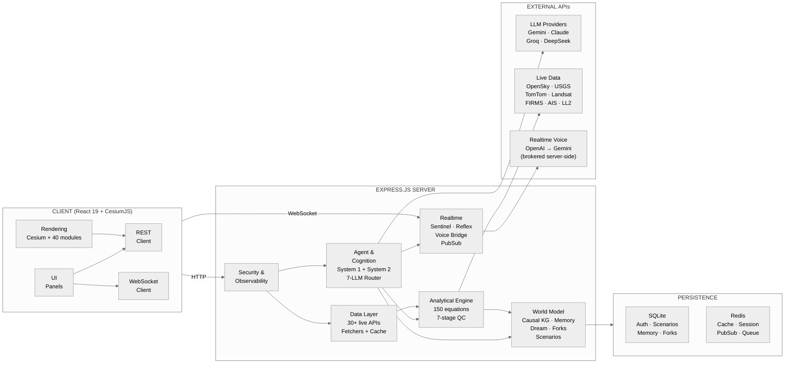
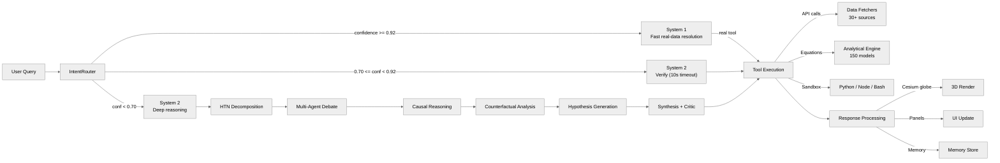

<p align="center">
  
</p>

# Terranoetis

A real-time geospatial intelligence platform. Terranoetis combines a photorealistic Cesium 3D globe with a comprehensive backend serving live environmental data, satellite imagery, **150 peer-reviewed scientific equation engines**, physics simulations, realtime voice, and AI-driven cognition. Unlike a passive globe viewer, Terranoetis **computes** — it runs scientific equations over live data, reasons about what it observes, and renders real results back onto the Earth.

<div align="center">

[](https://sreyassanker.vercel.app)
[](https://github.com/sreyassanker)
[](https://linkedin.com/in/sreyassanker)

</div>

---

## Overview

| Capability | Description |
|---|---|
| **150 Analytical Engines** | Peer-reviewed scientific equations across 26 domains — atmosphere, hydrology, seismology, oceanography, cryosphere, climate, space — each with input validation, quality control, uncertainty estimation, and interpretation |
| **Live Geospatial Data** | 30+ real-time data sources: USGS earthquakes, OpenSky flights, CelesTrak satellites, NOAA weather, NASA FIRMS, TomTom traffic, GBFS bikeshare, radio, CCTV, and more |
| **Photorealistic 3D Globe** | CesiumJS globe with Google Photorealistic 3D Tiles, sensor-style GLSL post-processing, and per-class 3D aircraft models |
| **AI Cognition** | Dual-process reasoning (System 1 fast / System 2 deep) over a 7-provider LLM router, with voice-driven command and camera control |
| **Realtime Voice** | Interruptible bidirectional audio — OpenAI Realtime with automatic Gemini Live fallback |
| **In-Browser Analytics** | DuckDB-WASM spatial SQL over live data layers — filter, join, and aggregate in the browser |
| **Disaster Simulation** | 7 Kaggle GPU simulation kernels (earthquake, tsunami, volcano, landslide, flood, hurricane, wildfire) on real terrain and data |

---

## Architecture



### Request Flow



---

## Analytical Engine

The platform implements **150 scientific equation engines** across **26 domains**, each grounded in a published source. Every computation passes through a **7-stage scientific pipeline**:

1. **Input Validation** — range, type, and physical-plausibility checks
2. **Preprocessing** — unit conversion and derived-parameter computation
3. **Computation** — the peer-reviewed equation
4. **Post-processing** — classification and unit normalisation
5. **Quality Control** — result sanity checks and outlier detection
6. **Uncertainty Estimation** — error propagation / empirical RMSE
7. **Interpretation** — contextual analysis and scientific recommendations

### Domain Coverage

| Part | Domains | Example Equations |
|------|---------|-------------------|
| I — Earth System Core | Atmospheric, hydrology, seismology, remote sensing, spatial analysis, soil | Split-window LST, FAO-56 ET, SCS-CN runoff, Gutenberg-Richter, Gumbel EV, kriging |
| II — Biosphere & Chemistry | Carbon cycle, agriculture, atmospheric chemistry | FvCB photosynthesis, Wanninkhof CO₂, Redfield ratios, Chapman ozone |
| III — Ocean & Coastal | Ocean circulation, coastal waves | TEOS-10 seawater, Stockdon runup, JONSWAP spectrum, Sverdrup transport |
| IV — Geomorphology & Cryosphere | Mass wasting, limnology, glacier & volcano | Stream power, Schmidt stability, glacier PDD, Morton-Taylor plume |
| V — Climate & Atmosphere | Climate dynamics, atmospheric dynamics, cloud physics | Budyko-Sellers EBM, frontogenesis, Köhler droplet |
| VI — Space Environment | Geodesy, ionosphere, satellite dynamics, GNSS | NRLMSISE-00, satellite drag, Kp index, Saastamoinen delay |
| VII — Engineering & Risk | Groundwater, hazard & risk, data assimilation, signal processing | Thiem, PMP, PDSI, EnKF, Klobuchar delay, Hohmann transfer |

### Key Features

- **Spatial grids** — 27 field tools rasterize over a study-area bbox (28×28) with per-cell terrain, weather, and satellite data, plus zonal statistics
- **Multi-scene composites** — satellite indices support max-value composite (MVC) across cloud-free scenes
- **Real-data provenance** — every result reports its live `dataSource` (e.g. USGS, ERA5, Landsat C2 L2); unavailable sources return honest `NaN` with a warning, never a fabricated value
- **PDF reports** — each result exports as a professional A4 scientific report
- **Natural-language search** — semantic search maps queries like "land surface temperature" to the correct engine

---

## AI Intelligence

The conversational agent is a **dual-process cognition** system:

- **System 1** — resolves high-confidence queries through real registered tools (weather, earthquakes, flights, EONET, GDACS, space weather)
- **System 2** — deep reasoning: HTN decomposition, multi-agent debate, causal reasoning, counterfactual analysis, hypothesis synthesis, and critic verification

**Voice-driven interaction** is a core flow: *"compute 100-year flood return level over Austin"* resolves deterministically to the Gumbel engine (model 40), which fetches the nearest USGS NWIS gauge's daily-discharge record, fits the distribution to water-year annual maxima, and returns the real return level in m³/s — painted onto the globe via SSE. Natural-language camera verbs ("orbit around this area slowly", "pan left", "tilt up") drive the cinematic camera engine without an LLM round-trip.

| Feature | Description |
|---|---|
| **Analytical compute → globe** | Equation results stream as `analytical_result` SSE events and auto-render as heatmaps |
| **Agentic globe control** | AI actions (flyTo, toggleLayer, addPin, addHeatmap, addPolygon) with undo/clear history |
| **Multimodal vision** | Images attached in chat analyzed via Gemini streaming vision |
| **RAG over live data** | Unified `search_all` across earthquakes, weather, fires, flights, vessels, satellites |
| **Local fallback** | Ollama when remote providers are unreachable |
| **Realtime voice** | `/ws/voice` — OpenAI Realtime → Gemini Live fallback, keys held server-side |

---

## Live Layers & Realtime

| Layer | Source |
|---|---|
| Street traffic (per-vehicle flow, congestion-colored) | TomTom |
| Flights (live ADS-B) | OpenSky |
| Satellites (TLE, live positions) | CelesTrak / UCS |
| Earthquakes | USGS |
| Wildfire | NASA FIRMS |
| Weather alerts | NOAA NWS |
| Radio (500 geolocated stations) | Radio Browser |
| Bikeshare | GBFS |
| CCTV viewsheds | opencctv.org |
| Walking routes | OSRM |
| Launch replay | Launch Library 2 |
| Disaster scenarios (7 types) | Generated from real terrain/data + Kaggle GPU kernels |
| **DuckDB Spatial SQL** | In-browser SQL over 7 live data layers |

---

## API

The server exposes hundreds of endpoints. Interactive documentation is served at **`/api/docs`** (Swagger UI) with the machine-readable spec at **`/api/openapi.json`** (OpenAPI 3.0.3).

### Key Endpoints

- **Health:** `/api/health`, `/api/ready`, `/api/live`, `/api/metrics`, `/api/observability/traces`, `/api/observability/metrics`
- **Auth:** `/api/auth/login`, `/api/auth/dev-login`, `/api/auth/refresh`
- **Analytical:** `/api/analytical-models`, `/api/analytical-models/search`, `/api/analytical-models/:id/execute`
- **Live data:** `/api/earthquakes`, `/api/flights/all`, `/api/satellites/tle`, `/api/space-weather/kp`, `/api/eonet`, `/api/gdacs/alerts`, `/api/weather/*`, `/api/data/radio_stations`, `/api/data/bikeshare`, `/api/cctv/worldwide`
- **Agent:** `/api/agent/ask` (SSE), `/api/agent/cognize`, `/api/agent/search-all`, `/api/agent/analyze-vision`
- **Scenarios:** `/api/scenarios/generate`, `/api/scenarios/search`, `/api/scenarios/export/:id`
- **Realtime:** `ws://host/ws/voice?token=...`, `ws://host/ws/agent?token=...`

---

## Security

- JWT authentication with role-based access control; JWT secret strength validated at startup
- Helmet CSP headers, restrictive content security policy, CORS scoped to `CLIENT_ORIGIN`
- Rate limiting (per-IP and per-user; public data endpoints capped at 300 req/min/IP)
- SSRF guard with DNS resolution and private-IP blocking on outbound URLs
- Input validation (Zod) and parameterized SQL queries
- Tenant isolation — ownership enforced on user resources; cross-user overwrite rejected
- Sentry error tracking (`SENTRY_DSN`), capturing 5xx + unhandled errors
- No API keys in source control — all credentials in `.env` (gitignored)

---

## Getting Started

### Prerequisites

- Node.js 20+
- Redis 7+
- Cesium Ion access token (free at https://ion.cesium.com)
- API keys for desired live layers (see `.env.example`)

### Installation

```bash
git clone https://github.com/sreyassanker/Terranoetis.git
cd Terranoetis
cp .env.example .env    # add your API keys
npm install
```

### Development

```bash
npm run dev             # client (3000) + server (3001) + Redis
```

### Production

```bash
docker compose up -d    # app + Redis + causal-service
```

### Testing

```bash
npm test                # 1,624 unit + integration tests
npx playwright test     # 8 E2E browser tests (compute demo, voice camera, DuckDB SQL, globe, scenarios)
```

---

## Environment

The `.env` file configures 60+ services. Notable keys:

- **Server:** `PROXY_PORT`, `JWT_SECRET`, `CLIENT_ORIGIN`
- **Globe:** `VITE_CESIUM_ION_ACCESS_TOKEN`
- **Traffic:** `TOMTOM_API_KEY`
- **Realtime voice:** `OPENAI_API_KEY` (optional, falls back to Gemini), `GOOGLE_GEMINI_API_KEY`
- **AI/LLM:** `ANTHROPIC_API_KEY`, `GROQ_API_KEY`, `OPENROUTER_API_KEY`, `DEEPSEEK_API_KEY`
- **Data:** USGS, NOAA, NASA FIRMS, Sentinel Hub, Copernicus, GBFS, Radio Browser
- **Error tracking:** `SENTRY_DSN` (optional)

Services gracefully disable features when their API key is absent.

---

## Documentation

- **Security policy:** [`SECURITY.md`](SECURITY.md)
- **Contributing:** [`CONTRIBUTING.md`](CONTRIBUTING.md)

---

## License

[MIT](LICENSE)

Copyright (c) 2026 Terranoetis
