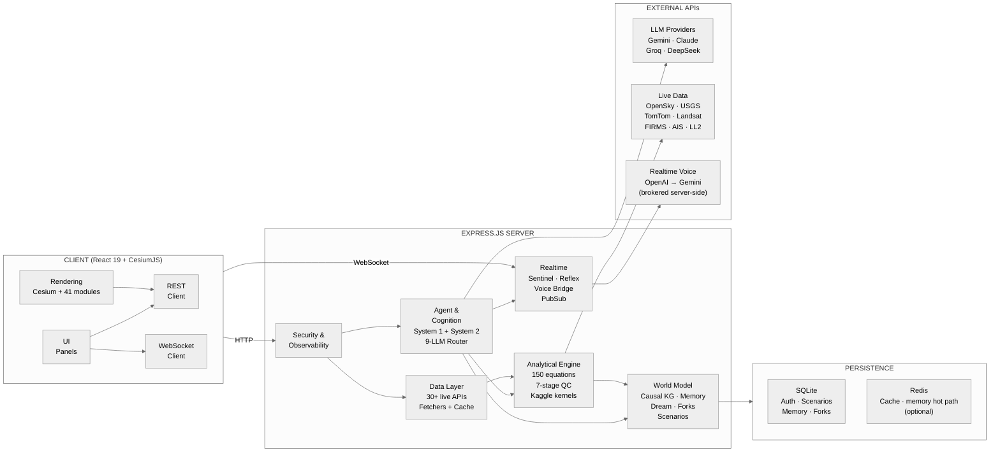
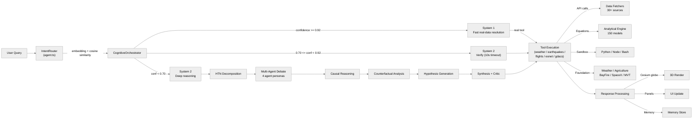
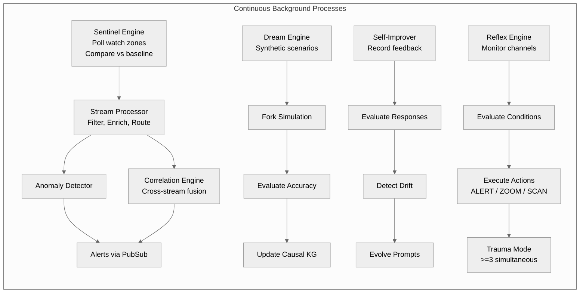

# Architecture

**Terranoetis** is a real-time geospatial intelligence platform built as a three-tier application:

- **Client** — React 19 + CesiumJS single-page application (Vite 7)
- **Server** — Node.js + Express 4 API, WebSocket realtime, JWT auth
- **Persistence** — SQLite (primary store) + optional Redis (cache, memory hot path). The event bus is an in-process publish/subscribe (`server/pubsub.ts`), not Redis.

> Rendered, navigation-first version of these documents with per-capability verification data: [docs site](../index.html).

This document describes the system topology, request lifecycle, background services, and the runtime modules that power the platform.

---

## Table of Contents

- [System Topology](#system-topology)
- [Request Flow](#request-flow)
- [Background Processes](#background-processes)
- [Frontend (`src/`)](#frontend-src)
- [Backend (`server/`)](#backend-server)
- [Storage Layer](#storage-layer)
- [External Integrations](#external-integrations)

---

## System Topology

### Component Inventory

| Layer | Location | Details |
|---|---|---|
| Client | `src/` | React 19, TypeScript, Vite 7, Tailwind CSS 3, CesiumJS 1.140 |
| Server | `server/` | Express 4, tsx runtime, TypeScript source files across module directories |
| Persistence | SQLite + Redis | better-sqlite3, ioredis |
| Containerization | Docker Compose | `terranoetis` (app), `redis` (cache), `causal-service` (Python) |

---

## Request Flow

The request lifecycle routes a natural-language user query through intent recognition, cognitive orchestration, and multi-stage tool execution.

### Routing

| Route | View | Description |
|---|---|---|
| `/` | App | Main Cesium globe application (~11,000 lines, 11 lazy-loaded panels) |
| `/v2/globe` | GlobePage | Dedicated Cesium globe viewport |
| `/v2/canvas` | CanvasPage | Spatial canvas |
| `/v2/scenarios` | ScenariosPage | Scenario gallery and editor |
| `/v2/tours` | ToursPage | Cinematic tours |

---

## Background Processes

The platform runs several continuous services that monitor live data, simulate scenarios, improve responses, and enforce safety.

### Service Table

| Service | Purpose |
|---|---|
| Sentinel Engine | Polls configured watch zones and compares live conditions against baselines |
| Stream Processor | Filters, enriches, and routes incoming data streams |
| Correlation Engine | Cross-stream fusion for anomaly detection |
| Dream Engine | Generates synthetic scenarios and evaluates them against ground truth |
| Self-Improver | Records feedback, evaluates responses, detects drift, evolves prompts |
| Reflex Engine | Monitors channels and executes actions (ALERT / ZOOM / SCAN) |
| Trauma Mode | Aggregated response when ≥3 simultaneous alerts fire |

---

## Frontend (`src/`)

The frontend internals are inventoried in [FRONTEND.md](FRONTEND.md): the 41 rendering modules (`src/rendering/`) with per-module purposes, the simulation overlay color map, and all 7 React hooks (`useChat`, `useWebSocket`, `useKaggleSimulation`, …). Routing:

| Route | View | Description |
|---|---|---|
| `/` | App | Main Cesium globe application (~11,000 lines, 11 lazy-loaded panels) |
| `/v2/globe` | GlobePage | Dedicated Cesium globe viewport |
| `/v2/canvas` | CanvasPage | Spatial canvas |
| `/v2/scenarios` | ScenariosPage | Scenario gallery and editor |
| `/v2/tours` | ToursPage | Cinematic tours |

---

## Backend (`server/`)

### Runtime Modules

| Module Directory | Purpose |
|---|---|
| `analytical-models/` | 150 equation engines grounded in primary literature (7 parts, 26 domains — counts verified), tool configs, workflows |
| `cognition/` | Cognitive orchestrator, System 1 / System 2, MCTS, reasoning tree, tree-of-thoughts |
| `sentinel/` | Continuous monitoring: stream processor, anomaly detector, correlation engine, alert intelligence |
| `memory/` + `memoryV2/` | Working/episodic/semantic/procedural/predictive memory, sensory buffer, Redis adapter |
| `scenarios/` | Scenario generation (single + batch), simulator engines, scenario DB |
| `sandboxV2/` | Simplified surrogate engines (`farsiteLite` cellular ROS, `adcircLite` storm-surge SWE, `wrfLite`, `hysplitLite` dispersion, `fnoSurrogate`) — surrogates named after, not reimplementations of, the operational models |
| `world-model/` | Causal graph, ensemble predictor, physics NN, prediction validator |
| `causal/` | Causal reasoning: KG, discovery engine, entropy mixer, Python microservice (DoWhy) |
| `kgV2/` | Knowledge graph v2: entity/edge generation, graph completion, counterfactual, evolving graph |
| `multimodal/` | Satellite analyzer, seismic processor, radar interpreter, sentiment analyzer, fusion |
| `ai-router/` | Omninet 9-provider LLM router (incl. local GGUF fallback) |
| `rag/` | Retrieval-augmented generation: embeddings, memory bridge |
| `h3-engine/` | H3 indexing, spatial query, ClickHouse, TimescaleDB, stream processor |
| `observability/` | Pino logger, metrics, in-house OpenTelemetry-style tracing, Sentry |
| `middleware/` | JWT auth, rate limiter, tenant isolation, audit, validation, error handler |
| `sandboxManager.ts` / `pluginManager.ts` | Sandbox execution + plugin extensibility |
| `selfImprover.ts` / `selfImproverV2.ts` | Feedback-driven self-improvement |
| `fork/` | Parallel reality fork manager |

---

## Storage Layer

### SQLite (better-sqlite3)

Primary store for authentication, scenarios, memory traces, forks, and application state.

### Redis (ioredis)

Optional acceleration layer: caching and the sensory/working memory hot path. The server **gracefully degrades** to SQLite when Redis is unreachable (see `server/infrastructure/redis.ts`). Realtime fan-out does not depend on it — `server/pubsub.ts` is an in-process `EventEmitter` bus and WebSocket/SSE delivery runs through it.

---

## External Integrations

| Category | Providers |
|---|---|
| LLM | Gemini, Claude, Groq, DeepSeek, OpenRouter, Bai, Ollama, HuggingFace, local LFM (GGUF) |
| Live data | OpenSky, USGS, TomTom, Landsat, FIRMS, AIS, Launch Library 2, CelesTrak, UCS |
| Realtime voice | OpenAI Realtime → Gemini Live (server-side brokering) |
| Earth observation | NASA Earthdata, Sentinel Hub, Copernicus, Planet Labs, Maxar |
| Weather & disaster | NOAA, NASA EONET, GDACS, OpenAQ, WAQI, Windy |

---

## Deployment

See [Deployment & Operations](DEPLOYMENT.md) for Docker Compose, CI/CD, environment variables, and security configuration.
